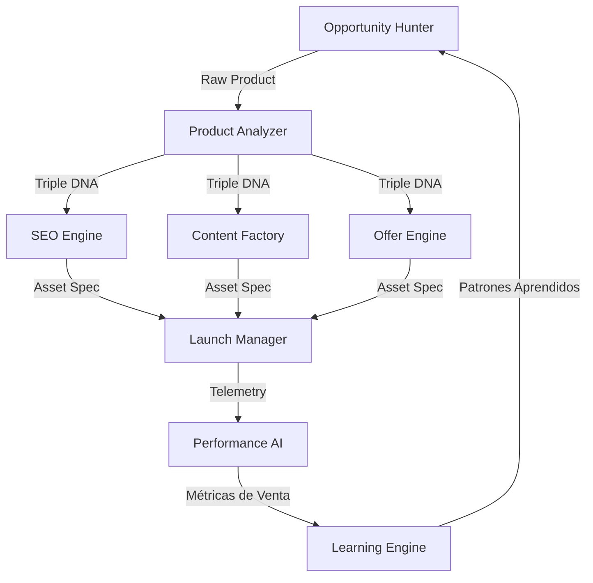

# Implementation Plan: Sprint 3 — LIAM Brain Architecture

Este plan detalla el diseño arquitectónico, el flujo de decisiones desacoplado y la estructura de componentes para construir el **LIAM Brain**, el cerebro operativo autónomo de MIleGo.

---

## 🛡️ Principio del Cerebro Desacoplado (LLM-Agnostic Engine)

> [!IMPORTANT]
> **La Regla de Capas de Decisión:** El cerebro de LIAM no depende de ningún proveedor de inteligencia artificial (LLM) específico.
> La lógica de negocio, las reglas comerciales y la memoria de aprendizaje viven en capas superiores dentro de MIleGo. Los modelos de IA externos (Gemini, OpenAI, Claude, etc.) son simples herramientas de ejecución que se alternan libremente en la capa inferior de proveedores.

---

## 1. Arquitectura por Capas del Cerebro (The Brain Stack)

El razonamiento y la toma de decisiones se organizan en 4 capas desacopladas:

```
+-------------------------------------------------------------+
|                     1. DECISION LAYER                       |
|  Coordina la ejecución de flujos (Lanzar, Optimizar, Parar) |
+-------------------------------------------------------------+
                              ↓
+-------------------------------------------------------------+
|                  2. BUSINESS RULES LAYER                    |
|  Valida límites comerciales (Márgenes > 40%, ROAS > 1.5)     |
+-------------------------------------------------------------+
                              ↓
+-------------------------------------------------------------+
|                 3. LEARNING MEMORY LAYER                    |
|  Inyecta históricos de éxito (UGC + dolor = mayor CTR)      |
+-------------------------------------------------------------+
                              ↓
+-------------------------------------------------------------+
|                   4. AI PROVIDER LAYER                      |
|  Traductor genérico hacia LLMs (Gemini, Claude, OpenAI)     |
+-------------------------------------------------------------+
```

### A. Capa 1: Decision Layer (Orquestador Autónomo)
*   Define las intenciones y coordina las llamadas entre los 8 sub-motores de LIAM (Opportunity Hunter, Product Analyzer, etc.).

### B. Capa 2: Business Rules Layer (Gobernanza de Negocio)
*   Asegura que ninguna recomendación de la IA viole las reglas comerciales duras (ej. no lanzar si el margen estimado es menor al 40%, no escalar anuncios si el ROAS es inferior a 1.8).

### C. Capa 3: Learning Memory Layer (Memoria de Negocio)
*   Busca patrones de éxito anteriores en la base de datos de aprendizaje para adjuntar instrucciones adicionales en los prompts de los modelos (ej. "Para productos de dolor, usa un gancho tipo UGC y un combo 2x").

### D. Capa 4: AI Provider Layer (Conectores Flexibles)
*   Clase adaptadora unificada. Traduce el prompt estructurado de MIleGo al formato específico de la API activa (Gemini, Claude, OpenAI o Llama).

---

## 2. Los 8 Módulos Especializados del Cerebro



1.  **Opportunity Hunter (Cazador de Oportunidades):**
    *   *Función:* Analiza Dropi, Triidy, AliExpress y Google Trends buscando productos emergentes.
2.  **Product Analyzer (Analizador de Propuesta de Valor):**
    *   *Función:* Deduce dolores de usuarios, disparadores emocionales e inyecta la información en el *Product DNA*.
3.  **SEO Engine (Motor de Indexación):**
    *   *Función:* Redacta títulos CRO, slugs, keywords de alto volumen y FAQs estructuradas para Google.
4.  **Content Factory (Fábrica de Creativos):**
    *   *Función:* Estructura copias para landing pages, guiones publicitarios de Meta/TikTok y mensajes de WhatsApp.
5.  **Offer Engine (Optimizador Financiero):**
    *   *Función:* Calcula precios y evalúa qué combo comercial (Combo 2x, Combo 3x o Envío Gratis) ofrece la mayor probabilidad de éxito comercial en base al histórico.
6.  **Launch Manager (Orquestador de Despliegue):**
    *   *Función:* Sincroniza el catálogo de la tienda, inyecta el pixel de conversión y publica la landing.
7.  **Performance AI (Analista de Métricas):**
    *   *Función:* Examina diariamente las ventas, CTR, CPA y ROAS para emitir alertas de optimización.
    *   *Ejemplo:* "CTR disminuyó un 20%. Recomiendo cambiar el gancho UGC de la landing."
8.  **Learning Engine (Motor de Aprendizaje):**
    *   *Función:* El más importante. Analiza correlaciones transversales entre todos los lanzamientos para registrar patrones de éxito.

---

## 3. Estructura de Carpetas Propuesta

El cerebro operativo se implementará bajo `backend/src/brain/` de la siguiente manera:

```text
backend/src/brain/
├── index.js                  # Punto de entrada / DecisionLayer orquestador
├── config/
│   └── business-rules.json   # Reglas duras de gobernanza comercial
├── providers/                # Adaptadores de LLMs
│   ├── base.provider.js      # Clase abstracta proveedora de IA
│   ├── gemini.provider.js    # Conector Google Gemini API
│   ├── openai.provider.js    # Conector OpenAI API
│   └── claude.provider.js    # Conector Anthropic Claude API
└── sub-engines/              # Los 8 agentes especializados de LIAM
    ├── hunter.js
    ├── analyzer.js
    ├── seo.js
    ├── content.js
    ├── offer.js
    ├── launcher.js
    ├── performance.js
    └── learning.js
```

---

## 4. Plan de Verificación

### Automated Tests
*   Crearemos una suite de pruebas en Vitest que verifique:
    1.  La alternancia fluida entre proveedores de IA (simulando respuestas de Gemini y OpenAI a través del `AIProviderLayer`).
    2.  La interceptación y veto de la Capa de Reglas de Negocio ante un producto inviable (ej. costo de $10.000 y sugerido de venta de $8.000).
    3.  El flujo orquestado de lanzamiento simulando los 8 sub-motores.
    ```bash
    npm test src/tests/liam-brain.test.js
    ```
