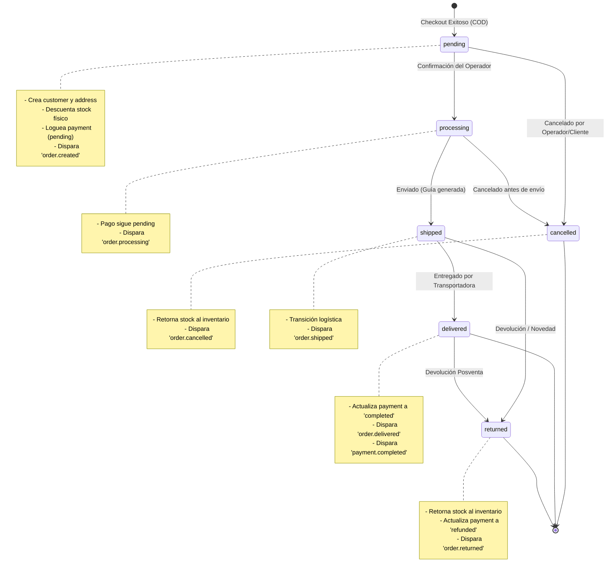

# Specification: End-to-End Order Flow & State Transitions (MIleGo V7.2)

Este documento define el ciclo de vida del pedido, sus estados de transición inmutables, las operaciones de base de datos asociadas, los disparadores de eventos y encolamiento de jobs. Sirve como referencia operacional para cumplir con el DoD de la fase **V7.2 — Commerce Core**.

---

## 🗺️ Diagrama de Transición de Estados del Pedido

---

## ⚙️ Detalle de Operaciones por Escenario

### 1. Checkout (Creación de Pedido - P0)
*   **Transacción de Base de Datos:**
    1.  Bloquear filas de inventario usando `SELECT ... FOR UPDATE` para evitar condiciones de carrera.
    2.  Verificar stock disponible.
    3.  Insertar/asociar `customer` y crear `customer_address`.
    4.  Insertar registro en `orders` con estado inicial `pending`.
    5.  Insertar registros en `order_items` con precio pactado en el checkout.
    6.  Insertar movimiento de inventario `out` (tipo `sale`) por cada ítem.
    7.  Insertar registro en `payments` con método `cash_on_delivery` y estado `pending`.
*   **Eventos & Jobs:**
    *   Publica el evento `order.created` al EventBus.
    *   El EventBus dispara handlers asíncronos para registrar tareas y encolar el Job de envío de email de confirmación al cliente.

---

### 2. Procesamiento y Confirmación
*   **Acción:** El operador revisa el panel de control, verifica la dirección o llama al cliente, y marca el pedido como "Confirmado" (cambio a `processing`).
*   **Transacción de Base de Datos:**
    1.  Actualizar el campo `status` a `processing` en la tabla `orders`.
    2.  Insertar registro de historial en `order_status_history` detallando el ID del usuario del staff y cualquier nota de confirmación.
*   **Eventos:**
    *   Publica el evento `order.status_changed` (nuevo estado: `processing`).

---

### 3. Cancelación
*   **Acción:** El cliente desiste de la compra o el operador no logra verificar los datos.
*   **Transacción de Base de Datos (Segura):**
    1.  Actualizar el campo `status` a `cancelled` en la tabla `orders`.
    2.  Insertar registro de historial en `order_status_history`.
    3.  **Retorno de Inventario:** Para cada ítem del pedido, insertar un movimiento de inventario `in` (tipo `restock`) y actualizar el stock sumando las unidades liberadas en las variantes de producto.
*   **Eventos:**
    *   Publica el evento `order.status_changed` (nuevo estado: `cancelled`) e `inventory.updated`.

---

### 4. Entrega Exitosa y Cierre de Pago
*   **Acción:** La transportadora confirma la entrega del pedido contra entrega y el recaudo del dinero.
*   **Transacción de Base de Datos:**
    1.  Actualizar el campo `status` a `delivered` en la tabla `orders`.
    2.  Insertar registro de historial en `order_status_history`.
    3.  Actualizar el campo `status` a `completed` en la tabla `payments`.
    4.  Insertar registro en `payment_status_history`.
*   **Eventos:**
    *   Publica los eventos `order.status_changed` (nuevo estado: `delivered`) y `payment.completed`.

---

### 5. Devolución (Retorno de Mercancía)
*   **Acción:** El paquete no pudo entregarse (novedad) o el cliente hace uso del derecho de retracto.
*   **Transacción de Base de Datos:**
    1.  Actualizar el campo `status` a `returned` en la tabla `orders`.
    2.  Insertar registro de historial en `order_status_history`.
    3.  **Retorno de Inventario:** Insertar movimiento de inventario `in` (tipo `restock`) y sumar stock.
    4.  Actualizar el pago asociado a `refunded` o `failed` según aplique.
*   **Eventos:**
    *   Publica los eventos `order.status_changed` (nuevo estado: `returned`) e `inventory.updated`.

---

## 📈 KPIs de Éxito Operativo y Monitoreo

*   **Tiempo de respuesta API de Checkout:** `< 300ms` (procesamiento directo y delegación de notificaciones/integraciones a jobs en segundo plano).
*   **Descuadre de Inventario Físico vs DB:** `0` unidades (asegurado por transacciones in-app y bloqueos de fila selectivos).
*   **Pedidos Duplicados:** `0` registros (evitado mediante constraints únicos de idempotencia en peticiones/formularios).
